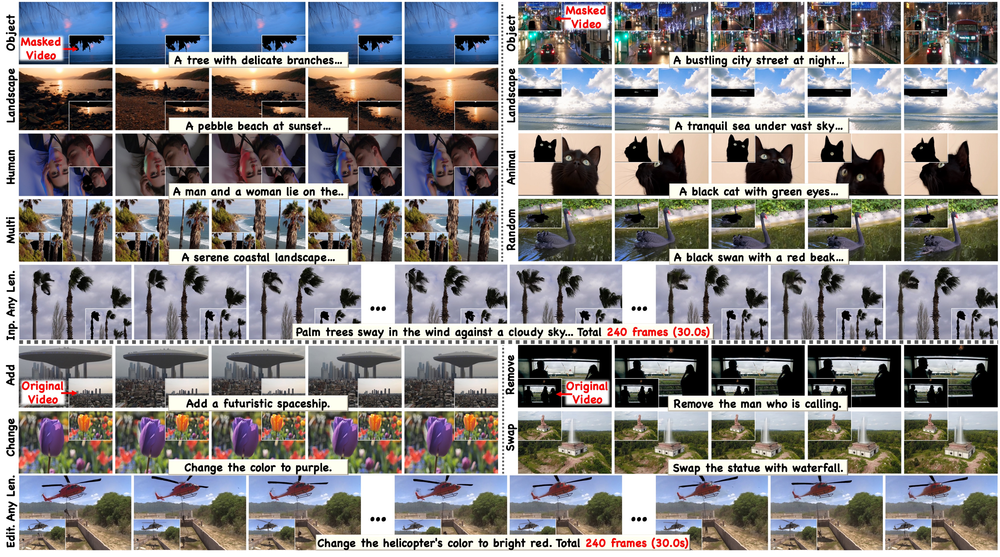

# VideoPainter

This repository contains the implementation of the paper "VideoPainter: Any-length Video Inpainting and Editing with Plug-and-Play Context Control"

Keywords: Video Inpainting, Video Editing, Video Generation

> [Yuxuan Bian](https://yxbian23.github.io/)<sup>12</sup>, [Zhaoyang Zhang](https://zzyfd.github.io/#/)<sup>1‡</sup>, [Xuan Ju](https://juxuan27.github.io/)<sup>2</sup>, [Mingdeng Cao](https://openreview.net/profile?id=~Mingdeng_Cao1)<sup>3</sup>, [Liangbin Xie](https://liangbinxie.github.io/)<sup>4</sup>, [Ying Shan](https://www.linkedin.com/in/YingShanProfile/)<sup>1</sup>, [Qiang Xu](https://cure-lab.github.io/)<sup>2✉</sup><br>
> <sup>1</sup>ARC Lab, Tencent PCG <sup>2</sup>The Chinese University of Hong Kong <sup>3</sup>The University of Tokyo <sup>4</sup>University of Macau <sup>‡</sup>Project Lead <sup>✉</sup>Corresponding Author


<p align="center">
<a href='https://yxbian23.github.io/project/video-painter'></a> &nbsp;
<a href="https://arxiv.org/abs/2503.05639"></a> &nbsp;
<a href="https://youtu.be/HYzNfsD3A0s"></a> &nbsp;
<a href='https://huggingface.co/datasets/TencentARC/VPData'></a> &nbsp;
<a href='https://huggingface.co/datasets/TencentARC/VPBench'></a> &nbsp;
<a href="https://huggingface.co/TencentARC/VideoPainter"></a>
</p>

**Your star means a lot for us to develop this project!** :star:


**📖 Table of Contents**


- [VideoPainter](#videopainter)
  - [🔥 Update Log](#-update-log)
  - [📌 TODO](#todo)
  - [🛠️ Method Overview](#️-method-overview)
  - [🚀 Getting Started](#-getting-started)
    - [Environment Requirement 🌍](#environment-requirement-)
    - [Data Download ⬇️](#data-download-️)
  - [🏃🏼 Running Scripts](#-running-scripts)
    - [Training 🤯](#training-)
    - [Inference 📜](#inference-)
    - [Evaluation 📏](#evaluation-)
  - [🤝🏼 Cite Us](#-cite-us)
  - [💖 Acknowledgement](#-acknowledgement)


## 🔥 Update Log
- [2025/3/09] 📢 📢  [VideoPainter](https://huggingface.co/TencentARC/VideoPainter) are released, an efficient, any-length video inpainting & editing framework with plug-and-play context control.
- [2025/3/09] 📢 📢  [VPData](https://huggingface.co/datasets/TencentARC/VPData) and [VPBench](https://huggingface.co/datasets/TencentARC/VPBench) are released, the largest video inpainting dataset with precise segmentation masks and dense video captions (>390K clips).

## TODO

- [x] Release trainig and inference code
- [x] Release evluation code
- [x] Release [VideoPainter checkpoints](https://huggingface.co/TencentARC/VideoPainter) (based on CogVideoX-5B)
- [x] Release [VPData and VPBench](https://huggingface.co/collections/TencentARC/videopainter-67cc49c6146a48a2ba93d159) for large-scale training and evaluation.
- [x] Release gradio demo
- [ ] Data preprocessing code
## 🛠️ Method Overview

We propose a novel dual-stream paradigm VideoPainter that incorporates an efficient context encoder (comprising only 6\% of the backbone parameters) to process masked videos and inject backbone-aware background contextual cues to any pre-trained video DiT, producing semantically consistent content in a plug-and-play manner. This architectural separation significantly reduces the model's learning complexity while enabling nuanced integration of crucial background context. We also introduce a novel target region ID resampling technique that enables any-length video inpainting, greatly enhancing our practical applicability. Additionally, we establish a scalable dataset pipeline leveraging current vision understanding models, contributing VPData and VPBench to facilitate segmentation-based inpainting training and assessment, the largest video inpainting dataset and benchmark to date with over 390K diverse clips. Using inpainting as a pipeline basis, we also explore downstream applications including video editing and video editing pair data generation, demonstrating competitive performance and significant practical potential. 



## 🚀 Getting Started

<details>
<summary><b>Environment Requirement 🌍</b></summary>


Clone the repo:

```
git clone https://github.com/TencentARC/VideoPainter.git
```

We recommend you first use `conda` to create virtual environment, and install needed libraries. For example:


```
conda create -n videopainter python=3.10 -y
conda activate videopainter
pip install -r requirements.txt
```

Then, you can install diffusers (implemented in this repo) with:

```
cd ./diffusers
pip install -e .
```

After that, you can install required ffmpeg thourgh:

```
conda install -c conda-forge ffmpeg -y
```

Optional, you can install sam2 for gradio demo thourgh:

```
cd ./app
pip install -e .
```
</details>

<details>
<summary><b>Data Download ⬇️</b></summary>


**VPBench and VPData**

You can download the VPBench [here](https://huggingface.co/datasets/TencentARC/VPBench), and the VPData [here](https://huggingface.co/datasets/TencentARC/VPData) (as well as the Davis we re-processed), which are used for training and testing the BrushNet. By downloading the data, you are agreeing to the terms and conditions of the license. The data structure should be like:

```
|-- data
    |-- davis
        |-- JPEGImages_432_240
        |-- test_masks
        |-- davis_caption
        |-- test.json
        |-- train.json
    |-- videovo/raw_video
        |-- 000005000
            |-- 000005000000.0.mp4
            |-- 000005000001.0.mp4
            |-- ...
        |-- 000005001
        |-- ...
    |-- pexels/pexels/raw_video
        |-- 000000000
            |-- 000000000000_852038.mp4
            |-- 000000000001_852057.mp4
            |-- ...
        |-- 000000001
        |-- ...
    |-- video_inpainting
        |-- videovo
            |-- 000005000000/all_masks.npz
            |-- 000005000001/all_masks.npz
            |-- ...
        |-- pexels
            |-- ...
    |-- pexels_videovo_train_dataset.csv
    |-- pexels_videovo_val_dataset.csv
    |-- pexels_videovo_test_dataset.csv
    |-- our_video_inpaint.csv
    |-- our_video_inpaint_long.csv
    |-- our_video_edit.csv
    |-- our_video_edit_long.csv
    |-- pexels.csv
    |-- videovo.csv
    
```

You can download the VPBench, and put the benchmark to the `data` folder by:
```
git lfs install
git clone https://huggingface.co/datasets/TencentARC/VPBench
mv VPBench data
cd data
unzip pexels.zip
unzip videovo.zip
unzip davis.zip
unzip video_inpainting.zip
```

You can download the VPData (only mask and text annotations due to the space limit), and put the dataset to the `data` folder by:
```
git lfs install
git clone https://huggingface.co/datasets/TencentARC/VPData
mv VPBench data
cd data
unzip video_inpainting.zip
```

Noted: *Due to the space limit, you need to run the following script to download the raw videos of the complete VPData. The format should be consistent with VPData/VPBench above (After download the VPData/VPBench, the script will automatically place the raw videos of VPData into the corresponding dataset directories that have been created by VPBench).*

```
cd data_utils
python VPData_download.py
```

</details>

<details>
<summary><b>Checkpoints</b></summary>

Checkpoints of VideoPainter can be downloaded from [here](https://huggingface.co/TencentARC/VideoPainter). The ckpt folder contains 

- VideoPainter pretrained checkpoints for CogVideoX-5b-I2V 
- VideoPainter IP Adapter pretrained checkpoints for CogVideoX-5b-I2V 
- pretrinaed CogVideoX-5b-I2V checkpoint from [HuggingFace](https://huggingface.co/THUDM/CogVideoX-5b-I2V). 

You can download the checkpoints, and put the checkpoints to the `ckpt` folder by:
```
git lfs install
git clone https://huggingface.co/TencentARC/VideoPainter
mv VideoPainter ckpt
```

You also need to download the base model [CogVideoX-5B-I2V](https://huggingface.co/THUDM/CogVideoX-5b-I2V) by:
```
git lfs install
cd ckpt
git clone https://huggingface.co/THUDM/CogVideoX-5b-I2V
```

[Optional]You need to download [FLUX.1-Fill-dev](https://huggingface.co/black-forest-labs/FLUX.1-Fill-dev/) for first frame inpainting:
```
git lfs install
cd ckpt
git clone https://huggingface.co/black-forest-labs/FLUX.1-Fill-dev
mv ckpt/FLUX.1-Fill-dev ckpt/flux_inp
```


The ckpt structure should be like:

```
|-- ckpt
    |-- VideoPainter/checkpoints
        |-- branch
            |-- config.json
            |-- diffusion_pytorch_model.safetensors
    |-- VideoPainterID/checkpoints
        |-- pytorch_lora_weights.safetensors
    |-- CogVideoX-5b-I2V
        |-- scheduler
        |-- transformer
        |-- vae
        |-- ...
    |-- flux_inp
        |-- scheduler
        |-- transformer
        |-- vae
        |-- ...
```
</details>

## 🏃🏼 Running Scripts

<details>
<summary><b>Training 🤯</b></summary>

You can train the VideoPainter using the script:

```
# cd train
# bash VideoPainter.sh

export MODEL_PATH="../ckpt/CogVideoX-5b-I2V"
export CACHE_PATH="~/.cache"
export DATASET_PATH="../data/videovo/raw_video"
export PROJECT_NAME="pexels_videovo-inpainting"
export RUNS_NAME="VideoPainter"
export OUTPUT_PATH="./${PROJECT_NAME}/${RUNS_NAME}"
export PYTORCH_CUDA_ALLOC_CONF=expandable_segments:True
export TOKENIZERS_PARALLELISM=false
export CUDA_VISIBLE_DEVICES=0,1,2,3,4,5,6,7

accelerate launch --config_file accelerate_config_machine_single_ds.yaml  --machine_rank 0 \
  train_cogvideox_inpainting_i2v_video.py \
  --pretrained_model_name_or_path $MODEL_PATH \
  --cache_dir $CACHE_PATH \
  --meta_file_path ../data/pexels_videovo_train_dataset.csv \
  --val_meta_file_path ../data/pexels_videovo_val_dataset.csv \
  --instance_data_root $DATASET_PATH \
  --dataloader_num_workers 1 \
  --num_validation_videos 1 \
  --validation_epochs 1 \
  --seed 42 \
  --mixed_precision bf16 \
  --output_dir $OUTPUT_PATH \
  --height 480 \
  --width 720 \
  --fps 8 \
  --max_num_frames 49 \
  --video_reshape_mode "resize" \
  --skip_frames_start 0 \
  --skip_frames_end 0 \
  --max_text_seq_length 226 \
  --branch_layer_num 2 \
  --train_batch_size 1 \
  --num_train_epochs 10 \
  --checkpointing_steps 1024 \
  --validating_steps 256 \
  --gradient_accumulation_steps 1 \
  --learning_rate 1e-5 \
  --lr_scheduler cosine_with_restarts \
  --lr_warmup_steps 1000 \
  --lr_num_cycles 1 \
  --enable_slicing \
  --enable_tiling \
  --noised_image_dropout 0.05 \
  --gradient_checkpointing \
  --optimizer AdamW \
  --adam_beta1 0.9 \
  --adam_beta2 0.95 \
  --max_grad_norm 1.0 \
  --allow_tf32 \
  --report_to wandb \
  --tracker_name $PROJECT_NAME \
  --runs_name $RUNS_NAME \
  --inpainting_loss_weight 1.0 \
  --mix_train_ratio 0 \
  --first_frame_gt \
  --mask_add \
  --mask_transform_prob 0.3 \
  --p_brush 0.4 \
  --p_rect 0.1 \
  --p_ellipse 0.1 \
  --p_circle 0.1 \
  --p_random_brush 0.3

# cd train
# bash VideoPainterID.sh
export MODEL_PATH="../ckpt/CogVideoX-5b-I2V"
export BRANCH_MODEL_PATH="../ckpt/VideoPainter/checkpoints/branch"
export CACHE_PATH="~/.cache"
export DATASET_PATH="../data/videovo/raw_video"
export PROJECT_NAME="pexels_videovo-inpainting"
export RUNS_NAME="VideoPainterID"
export OUTPUT_PATH="./${PROJECT_NAME}/${RUNS_NAME}"
export PYTORCH_CUDA_ALLOC_CONF=expandable_segments:True
export TOKENIZERS_PARALLELISM=false
export CUDA_VISIBLE_DEVICES=0,1,2,3,4,5,6,7

accelerate launch --config_file accelerate_config_machine_single_ds_wo_cpu.yaml --machine_rank 0 \
  train_cogvideox_inpainting_i2v_video_resample.py \
  --pretrained_model_name_or_path $MODEL_PATH \
  --cogvideox_branch_name_or_path $BRANCH_MODEL_PATH \
  --cache_dir $CACHE_PATH \
  --meta_file_path ../data/pexels_videovo_train_dataset.csv \
  --val_meta_file_path ../data/pexels_videovo_val_dataset.csv \
  --instance_data_root $DATASET_PATH \
  --dataloader_num_workers 1 \
  --num_validation_videos 1 \
  --validation_epochs 1 \
  --seed 42 \
  --rank 256 \
  --lora_alpha 128 \
  --mixed_precision bf16 \
  --output_dir $OUTPUT_PATH \
  --height 480 \
  --width 720 \
  --fps 8 \
  --max_num_frames 49 \
  --video_reshape_mode "resize" \
  --skip_frames_start 0 \
  --skip_frames_end 0 \
  --max_text_seq_length 226 \
  --branch_layer_num 2 \
  --train_batch_size 1 \
  --num_train_epochs 10 \
  --checkpointing_steps 256 \
  --validating_steps 128 \
  --gradient_accumulation_steps 1 \
  --learning_rate 5e-5 \
  --lr_scheduler cosine_with_restarts \
  --lr_warmup_steps 200 \
  --lr_num_cycles 1 \
  --enable_slicing \
  --enable_tiling \
  --noised_image_dropout 0.05 \
  --gradient_checkpointing \
  --optimizer AdamW \
  --adam_beta1 0.9 \
  --adam_beta2 0.95 \
  --max_grad_norm 1.0 \
  --allow_tf32 \
  --report_to wandb \
  --tracker_name $PROJECT_NAME \
  --runs_name $RUNS_NAME \
  --inpainting_loss_weight 1.0 \
  --mix_train_ratio 0 \
  --first_frame_gt \
  --mask_add \
  --mask_transform_prob 0.3 \
  --p_brush 0.4 \
  --p_rect 0.1 \
  --p_ellipse 0.1 \
  --p_circle 0.1 \
  --p_random_brush 0.3 \
  --id_pool_resample_learnable
```
</details>


<details>
<summary><b>Inference 📜</b></summary>

You can inference for the video inpainting or editing with the script:

```
cd infer
# video inpainting
bash inpaint.sh
# video inpainting with ID resampling
bash inpaint_id_resample.sh
# video editing
bash edit.sh
```

Our VideoPainter can also function as a video editing pair data generator, you can inference with the script:
```
bash edit_bench.sh
```

Since VideoPainter is trained on public Internet videos, it primarily performs well on general scenarios. For high-quality industrial applications (e.g., product exhibitions, virtual try-on), we recommend training the model on your domain-specific data. We welcome and appreciate any contributions of trained models from the community!
</details>

<details>
<summary><b>Gradio Demo 🖌️</b></summary>

You can also inference through gradio demo:

```
# cd app
CUDA_VISIBLE_DEVICES=0 python app.py \
    --model_path ../ckpt/CogVideoX-5b-I2V \
    --inpainting_branch ../ckpt/VideoPainter/checkpoints/branch \
    --id_adapter ../ckpt/VideoPainterID/checkpoints \
    --img_inpainting_model ../ckpt/flux_inp
```
</details>


<details>
<summary><b>Evaluation 📏</b></summary>

You can evaluate using the script:

```
cd evaluate
# video inpainting
bash eval_inpainting.sh
# video inpainting with ID resampling
bash eval_inpainting_id_resample.sh
# video editing
bash eval_edit.sh
# video editing with ID resampling
bash eval_editing_id_resample.sh
```
</details>

## 🤝🏼 Cite Us

```
@article{bian2025videopainter,
  title={VideoPainter: Any-length Video Inpainting and Editing with Plug-and-Play Context Control},
  author={Bian, Yuxuan and Zhang, Zhaoyang and Ju, Xuan and Cao, Mingdeng and Xie, Liangbin and Shan, Ying and Xu, Qiang},
  journal={arXiv preprint arXiv:2503.05639},
  year={2025}
}
```


## 💖 Acknowledgement
<span id="acknowledgement"></span>

Our code is modified based on [diffusers](https://github.com/huggingface/diffusers) and [CogVideoX](https://github.com/THUDM/CogVideo), thanks to all the contributors!
